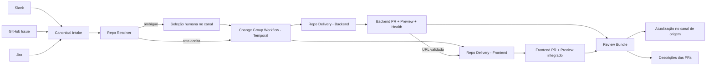
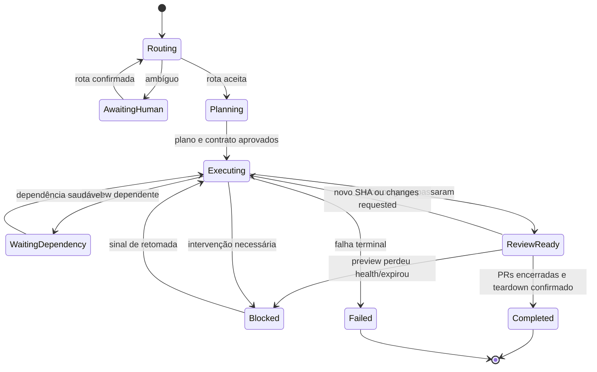

# Plano de evolução do DSE: intake multicanal, roteamento de repositórios e entrega multi-repo

**Status:** validado por três revisões independentes; pronto para decomposição em implementação  
**Escopo:** Slack, GitHub Issues, Jira, Temporal, seleção de repositórios, PRs e previews integrados  
**Repositórios de referência:** `bmo-fee-calculator-fe` e `bmo-fee-calculator-be`  
**Resultado esperado:** uma solicitação entra por qualquer canal, o DSE identifica os repositórios necessários, executa a mudança com rastreabilidade no Temporal e termina com um pacote de revisão contendo PRs e URLs de preview funcionais.

## 1. Decisão executiva

O DSE já possui a maior parte das peças isoladas: adaptadores de entrada, ingestão com outbox, workflow no Temporal, sandbox, roteamento de repositórios, geração de PR e preview. A lacuna principal não é criar outro pipeline; é coordenar corretamente uma única mudança que pode atravessar mais de um repositório.

A solução proposta é adicionar um **Change Group Workflow** no Temporal, reutilizando os workflows atuais de cada repositório. O grupo manterá um grafo pequeno de dependências, consolidará os resultados e só concluirá quando houver um pacote de revisão coerente.

Para uma mudança frontend + backend:

1. o contrato compartilhado é definido uma vez;
2. código e testes unitários podem avançar em paralelo;
3. o preview do backend é publicado e validado primeiro;
4. a URL saudável do backend é injetada no deploy do preview do frontend;
5. o frontend é publicado e validado contra aquele backend;
6. as duas descrições de PR recebem as URLs de preview e os links cruzados;
7. Slack, GitHub Issue ou Jira recebem um único pacote final de revisão.

Não é necessário criar um sistema genérico de orquestração de microsserviços. Um grupo, uma lista de trabalhos e dependências `backend-preview -> frontend-preview` resolvem o caso real sem ampliar desnecessariamente a arquitetura.

## 2. Evidências encontradas

### 2.1 Estado atual do DSE

- Slack, GitHub e Jira já possuem adaptadores e convergem para o gateway de ingestão.
- A outbox já dá proteção contra perda e duplicação entre ingestão e início do workflow.
- O roteador atual consulta o catálogo do tenant, pede uma classificação ao model gateway e limita a resposta aos repositórios realmente autorizados.
- O fan-out atual cria trabalhos irmãos com `group_id`, mas eles continuam independentes: não existe um coordenador que imponha dependências, reúna previews ou publique o resultado do grupo.
- O pipeline atual de evidência opera sobre um único `repo`, uma única PR e uma única `preview_url`.
- O preview já atualiza a descrição da PR de forma idempotente. Esse comportamento deve ser preservado e ampliado para o bloco completo de revisão.
- O DSE já prevê URL externa de preview, mas a configuração de produção deve garantir que a URL publicada seja acessível pelo navegador; DNS interno de cluster não é um link de review aceitável.

### 2.2 Repositórios BMO anexados

Os ZIPs foram usados como fotografia de referência. Antes de qualquer alteração real, o DSE deve comparar o commit/branch sincronizado em produção com essa fotografia, pois o conteúdo pode ter divergido.

#### Frontend

- Angular standalone, NGRX, Jest e Playwright.
- A tabela do dashboard já recebe `currentPage` e hoje mostra esse valor em uma coluna de texto.
- O frontend chama APIs por caminhos relativos `/api/...`.
- O Nginx encaminha `/api/` para o host configurado por `AUTH0_BE_LINK`; este é o ponto atual para conectar o preview do frontend ao preview do backend.
- A administração de grid payouts hoje identifica linhas removidas e dispara `DELETE /api/v1/grid-payouts/{id}`.
- Os grid payouts carregados em `global-data` alimentam as opções e os cálculos de taxas no frontend.

#### Backend

- Java/Spring Boot/Maven.
- `GET /api/v1/grid-payouts` lê `grid-payouts-data.json` usando `ClassPathResource.getFile()`.
- Esse acesso depende de um arquivo físico e tende a funcionar com classes expandidas no IDE, mas falha dentro de um JAR; a leitura correta deve usar stream do classpath.
- Não existe no snapshot um endpoint funcional `GET /api/v1/grid-payouts/{id}`.
- O snapshot ainda usa dados de referência em JSON e tem cobertura automatizada muito baixa. O plano exige teste empacotado/containerizado, não apenas teste iniciado pela IDE.
- Foi detectado material sensível em configuração versionada. O valor não deve ser copiado para logs, prompts ou PRs; a implementação deve remover o segredo do Git, rotacioná-lo e passar a usar secret store/variável de ambiente.

## 3. Princípios e invariantes

1. **Entrada agnóstica de canal:** Slack, GitHub Issue e Jira produzem o mesmo contrato interno.
2. **Temporal é o sistema de execução:** toda transição relevante do grupo e de cada repositório é durável, consultável e reexecutável.
3. **Modelo sugere; regras autorizam:** um LLM pode classificar intenção, mas não pode inventar nem obter acesso a repositórios fora do catálogo do tenant.
4. **Um pedido, um grupo:** uma solicitação multirrepositório não aparece ao usuário como tarefas desconectadas.
5. **Dependência explícita:** frontend integrado só fica pronto depois que o backend correspondente estiver saudável.
6. **URL efêmera não entra no código:** URLs de preview são injetadas no ambiente de deploy.
7. **Descrição da PR é obrigatória:** toda PR gerada pelo DSE contém o bloco gerenciado com os links de preview e revisão.
8. **Idempotência ponta a ponta:** repetição de webhook, Activity ou workflow não cria segundo work item, segunda branch, segunda PR ou segundo preview lógico.
9. **Falha não vira sucesso parcial:** se o backend integrado não estiver disponível, o frontend não é apresentado como preview integrado.
10. **Escopo mínimo:** só entram no grupo os repositórios onde existe uma alteração nomeável e verificável.
11. **Preview real:** quando o preview é obrigatório, imagem placeholder nunca pode produzir estado `created` ou `healthy`; a imagem deve ser comprovadamente derivada do `head_sha` da PR.
12. **Review é reversível:** `ReviewReady` não é terminal. Novo SHA, `changes_requested`, perda de health ou expiração invalida o bundle e reabre o grupo.

## 4. Arquitetura alvo



### 4.1 Componentes mantidos

- Adaptadores Slack, GitHub e Jira.
- Ingest gateway e outbox dispatcher.
- Catálogo e bindings de repositórios.
- Sandbox e workflow de entrega por repositório.
- Planner, Coder, testes, revisão e finalização de PR.
- Provisionamento de preview e atualização idempotente da descrição da PR.

### 4.2 Componente novo mínimo

`ChangeGroupWorkflow` será um workflow Temporal coordenador. Ele não executa código e não substitui o workflow atual por repositório. Suas responsabilidades são:

- persistir a rota aprovada e o grafo de dependências;
- liberar cada trabalho quando suas dependências estiverem prontas;
- receber sinais de progresso dos workflows membros;
- reconciliar estado persistido após falhas ou deploys;
- consolidar PRs, previews, checks e bloqueios;
- publicar e manter o pacote final de revisão.

Sob a feature flag `change_group_orchestration=true`, o dispatcher inicia primeiro o `ChangeGroupWorkflow`, com ID determinístico, em vez de iniciar diretamente um `WorkItemLifecycleWorkflow`. O grupo resolve rota e contrato e, somente então, uma transação cria os membros e eventos da outbox. Cada membro recebe `group_id`, `route_version`, `shared_plan_hash` e seu `repo_plan_slice`. Nenhum membro multi-repo entra em implementação antes de o plano compartilhado estar persistido. Com a flag desligada, o caminho legado permanece intacto.

Os workflows por repositório continuam como workflows Temporal de topo iniciados pela outbox. Isso reduz a migração e evita acoplar o ciclo de `continue-as-new` dos trabalhos ao ciclo de vida do coordenador. O planejamento compartilhado só é obrigatório para grupos multi-repo ou que possuam contrato/dependência; o caminho simples de um repo reutiliza o plano atual.

Os membros persistem marcos numa outbox antes de acordar o coordenador. Signals são wake-ups, não a única fonte da verdade: o grupo reconcilia periodicamente fatos persistidos para cobrir crash entre persistência e signal.

## 5. Contratos canônicos

### 5.1 ConversationEvent v2 e contexto de intake

O DSE já possui `ConversationEvent`; não será criado um `IntakeEnvelope` concorrente. O contrato existente deve evoluir de forma compatível e continuar preservando `content_snapshot` imutável. O conteúdo sanitizado usado por modelos é um campo/projeção diferente do snapshot de auditoria.

```json
{
  "tenant_id": "tenant",
  "event_id": "hash-de-transporte",
  "request_key": "hash-da-conversa",
  "platform": "slack|github|jira",
  "kind": "task_request|clarification_answer|approval|review_comment|steering",
  "source_instance_id": "workspace|installation|jira-site",
  "provider_event_key": "event/message/comment id",
  "conversation_key": "thread|issue|ticket",
  "source_ref": {},
  "actor": {
    "platform_user_id": "...",
    "resolved_principal": "..."
  },
  "content_snapshot": "texto original congelado",
  "signature_verified": true,
  "received_at": "ISO-8601"
}
```

- `event_id = hash(tenant_id, platform, source_instance_id, provider_event_key)` deduplica transporte e evita colisão entre workspaces/sites.
- `request_key = hash(tenant_id, platform, source_instance_id, conversation_key)` correlaciona o Change Group ativo.
- `tenant_id` vem de uma instalação/workspace/site validado. Em produção, origem sem binding é rejeitada ou quarentenada; fallback para tenant default fica restrito a dev/test por feature flag.
- O contexto derivado após a validação carrega `sanitized_content`, anexos autorizados e `route_hints`; ele não substitui o evento canônico.
- Deve haver unicidade de membro por `(group_id, repo)` e de grupo ativo por `request_key`.

### 5.2 RepoRoute

```json
{
  "repos": [
    {
      "repo": "org/bmo-fee-calculator-be",
      "role": "backend",
      "reason": "altera contrato e regra de referência de payout",
      "evidence": ["endpoint /api/v1/grid-payouts", "provider: grid-payouts"],
      "confidence": 0.98,
      "depends_on": []
    },
    {
      "repo": "org/bmo-fee-calculator-fe",
      "role": "frontend",
      "reason": "troca delete por retire e consome o novo estado",
      "evidence": ["consumer: /api/v1/grid-payouts", "admin/grid-payout"],
      "confidence": 0.98,
      "depends_on": ["org/bmo-fee-calculator-be:preview"]
    }
  ],
  "decision": "automatic|human_confirmed",
  "reason": "...",
  "route_version": 1,
  "route_hints": ["github-origin", "jira-component", "slack-binding"]
}
```

O contrato deve ser versionado nos `packages/contracts`. Repositórios devolvidos pelo modelo são sempre intersectados com o catálogo autorizado. Repo da Issue, binding ou referência explícita é uma evidência/hint; em tenant multi-repo não encerra o resolver antes que ele avalie alterações nomeáveis nos demais candidatos.

### 5.3 ChangeGroup

```json
{
  "group_id": "cg_<hash>",
  "intake_event_id": "...",
  "state": "routing|planning|executing|blocked|review_ready|completed|failed|cancelled",
  "route_version": 1,
  "members": ["work_item_id"],
  "dependency_graph": [],
  "review_bundle_version": 0
}
```

Persistência mínima recomendada:

- criar uma tabela `change_groups` com identidade, estado, rota em JSONB, versão e timestamps;
- reutilizar `work_items.group_id` para os membros;
- derivar PRs e evidências dos registros de work item existentes;
- não criar novas tabelas para cada tipo de evidência nesta fase.

### 5.4 PreviewDependency

```json
{
  "provider_repo": "org/bmo-fee-calculator-be",
  "consumer_repo": "org/bmo-fee-calculator-fe",
  "kind": "http_api",
  "external_url": "https://be-<group>.preview.example.com",
  "scheme": "https",
  "host": "be-<group>.preview.example.com",
  "health_status": "healthy",
  "head_sha": "...",
  "image_digest": "sha256:...",
  "required_for_review": true,
  "expires_at": "ISO-8601"
}
```

O contrato é separado em URL, scheme e host porque o template Nginx atual espera um host em algumas diretivas e uma URL em outras. A Activity de preview traduz esse objeto para a configuração específica do repositório.

### 5.5 ReviewBundle

```json
{
  "group_id": "...",
  "status": "ready|partial|blocked",
  "bundle_version": 3,
  "revision_vector": {"backend": "shaB", "frontend": "shaF"},
  "entries": [
    {
      "repo": "org/repo",
      "role": "frontend|backend",
      "pr_url": "https://github.com/org/repo/pull/123",
      "preview_url": "https://...",
      "head_sha": "...",
      "checks": "passed"
    }
  ],
  "primary_review_url": "https://frontend-preview...",
  "applied_to_all_pr_descriptions": true
}
```

Para backend-only, `primary_review_url` é a URL do backend/health ou a PR quando não houver UI. Para frontend-only e mudanças integradas, é a URL do frontend.

## 6. Intake por canal

### 6.1 Slack

- Receber mensagem, menção ou comando em thread autorizada.
- Responder rapidamente ao webhook e fazer todo trabalho pesado de forma assíncrona.
- Manter uma única mensagem de status editável por grupo.
- Quando a rota for ambígua, exibir multi-select + confirmação de repositórios com justificativa.
- A resposta final contém estado, PRs, previews, bloqueios e botão/link de revisão.

### 6.2 GitHub Issues

- O repositório da própria Issue é evidência forte, mas não limita uma mudança que exija outro repositório.
- Ler labels, formulário, referências explícitas e catálogo de dependências.
- Usar um comentário gerenciado, atualizado em vez de adicionar comentários a cada etapa.
- Resolver seleção ambígua por comando/comentário gerenciado com parsing determinístico e validação central.
- Adicionar links cruzados Issue ↔ PRs e não encerrar a Issue automaticamente antes da política definida pelo tenant.

### 6.3 Jira

- Resolver tenant e permissões pela instalação/site.
- Usar mapeamento `project + component + label -> repo` como evidência determinística.
- Criar/atualizar um comentário gerenciado com o mesmo conteúdo do Review Bundle.
- Resolver seleção ambígua pelo mesmo contrato de decisão validada usado nos demais canais.
- Opcionalmente transicionar o ticket apenas quando a configuração do tenant autorizar; comentário e links não dependem dessa automação.

### 6.4 Segurança e identidade

- Mapear identidade do canal para identidade DSE e permissões do tenant.
- Não aceitar nome de repositório informado no texto sem validar acesso.
- Toda escolha humana produz `RepoSelectionDecision {group_id, route_version, repos[], actor, source_event_id}`. Antes do signal, o serviço central valida ator, catálogo do tenant, acesso atual da instalação, branches permitidas e versão da rota. Texto livre nunca é aplicado diretamente a `input.repo`.
- Redigir tokens e segredos antes de logs, prompts e evidências.
- Tratar conteúdo de Issue/Jira/Slack como entrada não confiável contra prompt injection.

## 7. Identificação dos repositórios

Em tenants com múltiplos repositórios, adapters não definem a rota final. O `ChangeGroupWorkflow` sempre executa o resolver completo antes de criar membros. Repo da GitHub Issue e bindings Slack/Jira entram como `route_hints`: aumentam a força da evidência, mas não impedem inclusão de outro repo quando há uma edição concreta nele.

O resolver deve aplicar as seguintes etapas em ordem e registrar a evidência usada:

1. **Referência explícita validada:** URL/nome de repo, arquivo ou PR mencionado e pertencente ao tenant.
2. **Origem determinística:** repo da GitHub Issue; binding explícito do canal Slack; projeto/componente Jira.
3. **Catálogo de capacidades:** providers/consumers de APIs, papel (`frontend`, `backend`, `library`, `infra`), stack, caminhos-chave e capacidade de preview.
4. **Busca de evidência:** índice atualizado do repositório identifica símbolos, endpoints, telas e contratos citados.
5. **Classificador pelo model gateway:** escolhe somente entre candidatos autorizados e precisa justificar uma alteração concreta por repo; não cria autoridade a partir de confiança autodeclarada.
6. **Confirmação humana:** obrigatória quando não há evidência suficiente, existe empate relevante ou a rota adicionaria repositório sem uma edição nomeável.

### 7.1 Política de confiança

- Classificar evidência como `exact`, `strong` ou `weak`. Autoexecução só ocorre quando cada repo tem evidência `exact/strong` segundo regra determinística; score numérico do modelo é apenas telemetria.
- Se o classificador disser `frontend + backend`, deve explicar o que muda em cada lado.
- Se somente o frontend usa um campo já existente, não incluir backend.
- Se somente o comportamento de um endpoint muda sem alteração de consumo, não incluir frontend.
- Uma rota escolhida por humano é persistida como feedback, mas não altera automaticamente o catálogo global sem revisão.

### 7.2 Perfil de repositório necessário

Cada repo sincronizado deve publicar ou ter inferido um perfil versionado:

```yaml
role: frontend
stack: angular
capabilities:
  consumes:
    - /api/v1/grid-payouts
  owns:
    - reports-dashboard
    - grid-payout-admin-ui
preview:
  enabled: true
  kind: web
  required_for_review: true
  build_strategy: dockerfile
  container_port: 8080
  readiness_path: /en-US/
  smoke_paths:
    - /api/v1/grid-payouts
  dependency_env:
    http_api: AUTH0_BE_LINK
  required_env:
    - AUTH0_CLIENT_ID
    - AUTH0_DOMAIN
quality:
  unit: npm test -- --runInBand
  lint: npm run lint
  e2e: npm run playwright:test:ci
```

Além disso, o perfil versiona `default_branch`, `catalog_version`, origem/SHA da descoberta e a allowlist de variáveis injetáveis. O perfil pode ser inferido inicialmente, mas mudanças de capacidade devem entrar por PR e ter owner. Não depender exclusivamente de busca semântica em tempo de execução. Para estes dois repos, perfil versionado e manifest sincronizado são suficientes; um serviço genérico de índice semântico fica adiado.

## 8. Execução no Temporal

### 8.1 Estados do grupo



`ReviewReady` é um estado publicável, mas não terminal. O grupo permanece vivo durante revisão humana. Novo commit, pedido de mudança, perda de health ou expiração incrementa `review_bundle_version`, invalida o bundle anterior e retorna o grupo para execução/bloqueio. O grupo só termina após PRs merged/closed/cancelled e teardown confirmado.

### 8.2 Sequência do workflow

1. Normalizar e deduplicar intake com `ConversationEvent v2`.
2. Sob a feature flag, o dispatcher inicia o `ChangeGroupWorkflow`, e não o workflow de repo.
3. Criar `change_group`, resolver rota e, se necessário, aguardar decisão humana validada.
4. Para multi-repo, produzir e persistir plano/contrato compartilhado; para single-repo, reutilizar o plano atual.
5. Criar work items e eventos da outbox atomicamente por `group_id + repo`, incluindo `shared_plan_hash` e fatia do plano.
6. Executar os workflows de repo liberados pelo grafo.
7. Abrir ou atualizar PR draft por repo.
8. Executar gates locais e CI seletiva.
9. Publicar previews respeitando dependências.
10. Atualizar o bloco DSE em todas as descrições de PR e confirmar por read-after-write.
11. Executar smoke/E2E integrado.
12. Marcar PRs prontas e publicar Review Bundle no canal de origem.

### 8.3 Paralelismo seguro

- Planejamento de contrato ocorre antes do fan-out de código.
- Implementação e testes unitários de frontend/backend podem rodar em paralelo.
- Backend build/deploy/health deve concluir antes do deploy do frontend integrado.
- A falha de uma dependência sinaliza `blocked_dependency_preview`; não reinicia código que não mudou.

`AwaitingHuman`, `WaitingDependency`, health e publicação do bundle possuem deadline e reminder duráveis. Cancelamento do grupo sinaliza todos os membros top-level, aguarda acknowledgements por tempo limitado e executa teardown idempotente. Falha parcial mantém estado `Blocked/Partial` explícito; nunca deixa outro membro parecer um sucesso integrado.

### 8.4 Idempotência e determinismo

- `group_id = hash(tenant_id, source, source_event_id)`.
- `work_item_id = hash(group_id, repo)`.
- Branch estável por work item.
- Finalização adota PR existente antes de criar uma nova.
- Namespace/host de preview estável por grupo + repo + PR.
- Bloco de descrição delimitado por markers e atualizado por substituição.
- Activities externas usam chave idempotente e persistem o resultado antes de sinalizar o workflow.
- O histórico do workflow armazena IDs e resultados; chamadas de rede ficam apenas em Activities.
- Cada operação externa adota efeito existente após timeout: PR por branch/head, preview por grupo/repo/SHA, bloco por marker/versão e chamada de modelo por work item/estágio/repair key.

O coordenador mantém um `revision_vector`, por exemplo `{backend: shaB, frontend: shaF}`. Cada marco contém `event_id`, `member_id`, `member_seq`, `head_sha`, `milestone`, `preview_url` e `dependency_shas`; eventos duplicados, fora de sequência ou com SHA obsoleto são ignorados. Antes de `ReviewReady`, uma Activity reconcilia heads atuais, checks, health, digest das imagens, descrições das PRs e `frontend.upstream_sha == backend.head_sha` no mesmo vetor.

Os fatos coordenáveis são mantidos pequenos: `revision_changed`, `pr_available`, `preview_healthy` e `terminal`. Checks intermediários são lidos na reconciliação. Outbox garante entrega; signal acorda o grupo. A projeção `change_groups` usa `state_version`/CAS para impedir overwrite atrasado.

Em `continue-as-new`, o grupo carrega somente estados compactos dos membros, últimas sequências, revision vector, contadores/fingerprints, bundle version e deadlines. Sinais pendentes são processados antes de fechar o run. A implantação exige patch/versionamento replay-safe, replay de histories reais e retenção do worker anterior até drenar execuções antigas.

### 8.5 Prevenção de loops

- Retry de Activity Temporal e reparo de negócio são orçamentos diferentes.
- Cada work item usa um único `automated_repair_count`, compartilhado por Tester, L1, L2 e CI e preservado em `continue-as-new`; padrão inicial: dois reparos no total, não dois por gate.
- `repair_key = hash(gate, comando, erro_normalizado, head_sha)`. O mesmo repair key no mesmo SHA nunca aciona outro Coder.
- Se o Coder não muda o SHA, Tester/L1 não repetem; uma segunda saída no-op escala imediatamente.
- `test_flake`, classificado por regra/resultado estruturado, repete somente o teste uma vez no mesmo SHA.
- `environment` e `dependency` repetem somente a Activity afetada; `policy` e `unknown` não entram automaticamente no Coder.
- Feedback humano possui contador separado e precisa produzir critério de aceite novo/verificável para abrir outro ciclo.
- Reutilizar no-op, contadores, deadline de CI, heartbeat e guards de `continue-as-new` já existentes, migrando-os para o orçamento unificado em vez de criar mecanismo paralelo.

## 9. Previews multi-repositório

### 9.1 Ordem e contrato

Para `backend -> frontend`:

1. gerar imagem/artefato do commit da PR backend;
2. publicar em namespace isolado;
3. validar digest/head SHA, readiness, health e smoke da API;
4. emitir `PreviewDependency` com URL externa e SHA;
5. injetar a dependência no manifest/ConfigMap/env do preview frontend;
6. publicar o frontend;
7. confirmar, pela URL frontend, que `/api/v1/grid-payouts` chega ao backend esperado e validar `/readiness` diretamente na URL backend;
8. executar Playwright pela URL externa do frontend.

No primeiro golden flow BMO, o backend externo deve ter TLS válido em `https:443`; a Activity extrai e injeta somente o host allowlisted em `AUTH0_BE_LINK`, como o Nginx atual exige. Segredos são referenciados por `SecretRef`, nunca transportados em payload Temporal. O deploy executa `envsubst` e `nginx -t` antes de ficar saudável. A URL não é escrita em `default.conf.template`, `environment.ts` ou qualquer commit. Separar depois `API_BACKEND_SCHEME`, `API_BACKEND_HOST` e `API_BACKEND_PORT` é P1, não bloqueia o primeiro fluxo.

Os profiles BMO devem definir probes por repo, não pela configuração global do worker:

- frontend: `container_port: 8080`, readiness `/en-US/` ou `/` validado no container;
- backend: `container_port: 8080`, readiness `/readiness`, smoke `/api/v1/grid-payouts`;
- backend precisa de Dockerfile Java multistage e `application-preview.yml` com banco efêmero/sintético e nenhuma credencial de produção.

Quando `required_for_review=true`, fallback para imagem placeholder é proibido. Se o DSE não conseguir construir uma imagem da PR ou comprovar seu digest contra o `head_sha`, o estado é `blocked_preview_build`, nunca `created`. O comportamento fail-open fica restrito a evidências opcionais, como vídeo/visual diff; previews do frontend, backend e dependências dos golden flows são fail-closed.

### 9.2 URLs na descrição da PR

Este requisito é obrigatório. Toda PR gerada pelo DSE terá um bloco gerenciado:

```markdown
<!-- dse-review:start -->
## DSE Review

- Group: `cg_...`
- This PR: Backend — https://github.com/org/be/pull/123
- Backend preview/API: https://be-cg.preview.example.com
- Related frontend PR: https://github.com/org/fe/pull/456
- Integrated frontend preview: https://fe-cg.preview.example.com
- Checks: passed
- Preview expires: 2026-08-09T12:00:00Z
<!-- dse-review:end -->
```

Regras:

- backend-only contém PR backend e URL da API/health;
- frontend-only contém PR e URL frontend;
- mudança integrada contém as duas PRs e as duas URLs em **ambas** as descrições;
- a atualização é idempotente e preserva texto escrito por humanos fora dos markers;
- `ReviewReady` exige que a mesma `bundle_version` tenha sido confirmada por read-after-write em todas as PRs; erro de GitHub bloqueia publicação, não vira apenas warning;
- uma URL só recebe o rótulo `ready` depois de health/smoke;
- nova execução substitui a URL obsoleta, sem duplicar linhas;
- expiração, remoção ou falha posterior atualiza o estado do link.

### 9.3 Ciclo de vida

- TTL configurável e visível na PR.
- Na primeira versão, TTL fixo com extensão manual/status explícito; renovação automática sofisticada fica adiada.
- Destruição idempotente ao fechar/mesclar PR ou ao vencer TTL.
- Rebuild somente do repo cujo SHA mudou; dependentes são republicados apenas quando a referência upstream mudou.
- Nenhum preview usa dados ou credenciais de produção.

## 10. Casos de aceite obrigatórios

### Caso 1 — Frontend only

> “On the reports dashboard, show at a glance whether each report is still in progress or finished — a coloured badge, not just the page name buried in a column.”

**Rota esperada:** somente `bmo-fee-calculator-fe`.

**Justificativa:** `FeeReportResponse.currentPage` já existe no frontend e `generate_report` já representa o estágio final. A mudança pedida é de apresentação; não há contrato novo para o backend.

**Mudança de referência:** 

- adicionar coluna/status visual em `dashboard-list`;
- mapear `generate_report -> Finished` e demais páginas válidas -> `In progress`;
- usar badge com texto, cor, contraste e label acessível; não depender apenas da cor;
- manter a página atual apenas como tooltip/detalhe se ainda for útil.

**Testes mínimos:**

- unitário para o mapeamento de status, incluindo valor desconhecido;
- teste de componente para badge terminado/em progresso e acessibilidade;
- Playwright confirmando ambos os estados na tabela;
- lint, testes Jest afetados e build de produção.

O preview frontend-only usa uma dependência de dados segura declarada no perfil: backend baseline da branch base, ambiente QA sanitizado ou fixture controlada capaz de fornecer relatórios em ambos os estados. Isso não cria PR backend e nunca aponta para produção.

**Resultado esperado:** uma PR frontend; descrição com URL frontend; nenhuma PR backend; Review Bundle publicado no canal de origem.

### Caso 2 — Backend only

> “Calling the payout-levels API in the deployed container comes back as a 500 even though it works fine when I run the service from my IDE — fix that, and while you’re in there let me fetch a single payout level by its id.”

**Rota esperada:** somente `bmo-fee-calculator-be`.

**Justificativa:** trata-se de carregamento de recurso empacotado e de um endpoint adicional. O serviço frontend já possui cliente para `GET /grid-payouts/{id}`, portanto não exige alteração para consumir o novo endpoint.

**Mudança de referência:**

- substituir `ClassPathResource.getFile()` por leitura via `getInputStream()`/`ObjectMapper.readValue(InputStream, ...)`;
- aplicar o mesmo padrão aos demais JSONs de classpath para não deixar o mesmo defeito latente;
- introduzir tipo de domínio/DTO para payout em vez de `List<Object>`;
- implementar `GET /api/v1/grid-payouts/{id}`;
- responder `200` para ID existente, `404` estruturado para inexistente e nunca `500` para ausência;
- remover stack trace direto e usar logging/tratamento de exceção da aplicação.

**Testes mínimos:**

- teste de controller/service para lista, ID existente e 404;
- teste com recurso carregado do classpath;
- `mvn package`, execução do JAR empacotado e smoke HTTP;
- build/execução da imagem usada no deploy e smoke do container;
- backend preview saudável com links para health e endpoint na PR.

**Enablement obrigatório:** como o snapshot backend não contém Dockerfile compatível com o builder atual do DSE, o primeiro trabalho inclui Dockerfile Java multistage, `application-preview.yml` e perfil com porta/probes. Placeholder não satisfaz este caso.

**Resultado esperado:** uma PR backend; descrição com URL backend; nenhuma PR frontend; Review Bundle publicado no canal de origem.

### Caso 3 — Frontend + backend

> “Admins need to retire a payout level instead of deleting it, and retired levels must stop feeding advisor fee calculations.”

**Rota esperada:** `bmo-fee-calculator-be` e `bmo-fee-calculator-fe`, com dependência de preview backend → frontend.

**Responsabilidade backend:**

- persistir estado `ACTIVE|RETIRED`, data e autor da aposentadoria;
- fornecer operação idempotente de retire, preferencialmente `PATCH /api/v1/grid-payouts/{id}` com `status: RETIRED`;
- impedir delete destrutivo pela rota funcional usada pela UI;
- `GET /api/v1/grid-payouts` retorna apenas ativos por padrão;
- acesso administrativo usa `includeRetired=true`, sujeito a autorização;
- garantir que qualquer cálculo backend futuro/use case de referência também filtre ativos;
- manter registros aposentados para auditoria e referências históricas.

**Responsabilidade frontend:**

- adicionar `status` ao modelo;
- substituir detecção/dispatch de delete por ação de retire;
- exibir aposentados no contexto administrativo com estado e sem tratá-los como removidos;
- carregar somente níveis ativos no fluxo de referência para novos cálculos;
- validar defensivamente o status no selector que produz opções de payout;
- preservar relatórios históricos que já guardem o payout selecionado, conforme regra de negócio aprovada.

**Contrato a aprovar no planejamento:** nomes do estado, endpoint PATCH, comportamento de relatórios históricos e quem pode reativar. A implementação não começa em paralelo antes desse contrato ser registrado no grupo.

O snapshot anexado só expõe dados estáticos em JSON; ele não demonstra persistência real suficiente para retirement. A comparação com o branch/SHA sincronizado é um gate: se a implementação de produção também for estática, o caso 3 para e solicita decisão de persistência/migração em vez de simular retirement não durável.

**Testes mínimos:**

- backend: migração/modelo, retire idempotente, filtro padrão, includeRetired autorizado e não autorizado;
- frontend: service/effect/reducer/selector e componente admin;
- contrato: payload ativo/aposentado compatível nos dois repos;
- integração: publicar backend, injetar sua URL no frontend e validar o upstream por SHA/header de diagnóstico;
- Playwright headless direcionado por `PLAYWRIGHT_BASE_URL`: admin aposenta um nível; ele continua visível como aposentado no admin; deixa de aparecer para novo cálculo de advisor fee; outro nível ativo continua calculando normalmente;
- regressão de histórico conforme decisão de produto.

**Resultado esperado:** duas PRs draft correlacionadas; duas URLs; frontend preview conectado ao backend preview; as duas descrições contêm o pacote completo; PRs prontas somente depois do E2E integrado.

## 11. Plano de implementação

### Fase 0 — Baseline e proteção

**Entregas**

- registrar branch e SHA realmente sincronizados no DSE para os dois repos;
- comparar os ZIPs com o estado remoto antes de usar caminhos/contratos como verdade atual;
- tratar essa comparação como gate do caso 3 e confirmar a persistência real do backend;
- medir duração e taxa de falha do fluxo atual;
- remover/rotacionar segredo versionado do backend e ativar secret scan;
- criar enablement de preview backend: Dockerfile Java, perfil de execução, `application-preview.yml` e dados/banco sintéticos;
- criar feature flag `change_group_orchestration` por tenant.

**Saída:** baseline reproduzível, nenhum segredo ativo no repositório e rollback pela feature flag.

### Fase 1 — Contratos e persistência

**Entregas**

- evoluir `ConversationEvent` para v2 e adicionar `RepoSelectionDecision`, `RepoRoute`, `ChangeGroup`, `PreviewDependency` e `ReviewBundle`;
- criar migration mínima de `change_groups` e índices por tenant/event/state;
- versionar payloads e aceitar leitura da versão anterior;
- adicionar testes de boundary/serialização entre serviços.

**Saída:** contratos compatíveis e migration reversível/expand-first.

### Fase 2 — Roteamento explicável e multicanal

**Entregas**

- manter os três adaptadores no `ConversationEvent` versionado e separar contexto derivado/sanitizado;
- enriquecer perfis dos repos BMO com owns/consumes/provides/preview;
- transformar repo de origem e bindings em `route_hints`; em tenant multi-repo, sempre executar o resolver completo;
- aplicar a cascata determinística + classificador limitado;
- implementar `RepoSelectionDecision` validada e multi-repo em cada canal;
- persistir razão, evidência, confiança e versão do catálogo.

**Saída:** os três prompts de aceite produzem respectivamente `FE`, `BE` e `BE+FE`, com fallback humano testado.

### Fase 3 — Coordenador Temporal

**Entregas**

- adaptar dispatcher para iniciar o grupo sob feature flag, antes de qualquer workflow membro;
- implementar e registrar `ChangeGroupWorkflow`, signals/queries e Search Attributes/Memo (`tenant_id`, `group_id`, estado, rota);
- adaptar fan-out para persistir plano compartilhado e criar grupo/membros atomicamente via outbox;
- emitir somente marcos coordenáveis (`revision_changed`, `pr_available`, `preview_healthy`, `terminal`) com sequence/SHA;
- liberar dependências sem polling contínuo;
- reconciliar fatos persistidos, revision vector e efeitos externos após timeout/retry;
- incorporar orçamento único de reparo, fingerprint e limite de loops;
- definir deadlines, cancelamento, `continue-as-new` compacto e estratégia de replay/versionamento.

**Saída:** uma execução multirrepositório sobrevive a restart e nunca publica conclusão antes dos membros.

### Fase 4 — Preview dependente

**Entregas**

- estender trigger/resultado de preview com repo, role, SHA e dependências;
- adicionar `required_for_review`, build strategy, porta, probes, env allowlist e SecretRefs ao perfil/contrato;
- publicar URL externa por repo;
- criar health/smoke gate backend;
- injetar `PreviewDependency` no frontend por manifest/env;
- confirmar que o frontend alcança o backend correto;
- proibir placeholder e comprovar digest/head SHA em preview obrigatório;
- implementar TTL e teardown do grupo.

**Saída:** caso 3 acessível pela URL frontend e comprovadamente conectado ao backend do mesmo grupo.

### Fase 5 — PR e pacote de revisão

**Entregas**

- abrir PR draft antes de preview quando útil para feedback de CI;
- implementar bloco `dse-review` idempotente;
- atualizar todas as PRs quando uma URL do grupo mudar;
- reconciliar/read-after-write a mesma bundle version em todas as descrições;
- publicar Review Bundle em Slack/GitHub/Jira;
- marcar PRs ready somente após gates do grupo.

**Saída:** 100% das PRs DSE têm links de preview na descrição; caso integrado tem links cruzados completos.

### Fase 6 — Golden flows e rollout

**Entregas**

- executar os três casos sobre forks/branches controlados dos repos BMO;
- testar duplicação de webhook, timeout, restart do worker, preview indisponível e retry de GitHub;
- canário em um tenant/canal, depois três canais;
- criar runbook, dashboard e alarmes;
- remover caminho legado somente depois de duas semanas sem rollback.

**Saída:** Definition of Done atendida e feature flag ampliada gradualmente.

## 12. Estratégia de testes

| Camada | Cobertura obrigatória |
|---|---|
| Contrato | encode/decode e compatibilidade de Intake, Route, Group, Preview e Bundle |
| Roteamento | matriz 3×3: cada prompt em Slack, GitHub Issue e Jira; repo explícito, binding conflitante, ambiguidade e repo alucinado |
| Temporal | signal antes do start, duplicado/fora de ordem/SHA antigo, signal na fronteira de continue-as-new, crash persistência→signal, novo push após ReviewReady, cancelamento parcial, replay pré-mudança e restart |
| Persistência/outbox | evento duplicado, criação atômica de grupo/membros e redelivery |
| PR | adoção idempotente, publicação parcial, read-after-write, atualização de bloco sem apagar texto humano e links cruzados |
| Preview | imagem real do SHA, porta/probe por repo, URL externa, health, TTL, teardown e atualização após novo SHA |
| Dependência | frontend recebe backend correto e bloqueia quando upstream não está saudável |
| Produto | três golden flows descritos na seção 10 |
| Segurança | autorização cross-tenant, prompt injection, segredo em diff/log e URL malformada |

Testes caros de cluster e Playwright devem rodar uma vez por grupo/estado relevante, não em todo ciclo de correção. Unitários afetados e checks estáticos rodam antes; E2E integrado roda após os dois previews estabilizarem.

## 13. CI/CD e tempo de execução

Para não repetir o problema atual de CI lenta:

- separar CI do próprio DSE da validação dos repositórios alvo;
- usar paths-filter para executar somente pacotes/serviços afetados;
- cachear Maven, npm, imagens e dependências por lockfile;
- cancelar runs superseded da mesma branch/PR;
- executar lint/unitários independentes em paralelo;
- não reconstruir backend quando somente o SHA frontend mudou;
- não repetir Planner/Coder/revisores por falha de cluster, registry ou GitHub;
- reservar cluster E2E para o último gate e para mudanças no orquestrador/preview;
- registrar tempo por estágio e critical path, não apenas tempo total.

Metas iniciais, a validar com baseline:

- p50 intake → PR draft simples: até 10 min;
- p95 intake → review pronto simples: até 30 min;
- p95 multi-repo → review integrado: até 45 min;
- zero PR/preview duplicado por redelivery;
- 100% das PRs finais com bloco de revisão na descrição.

## 14. Observabilidade e operação

### Métricas

- duração por canal, tenant, repo e fase;
- rota escolhida, confiança, confirmação humana e correções de rota;
- grupos por estado e idade;
- membros bloqueados por dependência;
- retries por classificação de falha;
- fingerprints repetidos e loops interrompidos;
- duração de build/deploy/health/E2E por repo;
- PRs e previews duplicados evitados;
- taxa de Review Bundle completo.

### Logs e tracing

Todos os registros usam `tenant_id`, `group_id`, `work_item_id`, `repo`, `workflow_id`, `run_id` e `source_ref` redigido. URLs de preview podem ser registradas; tokens, payloads de autenticação e segredos nunca.

### Alertas

- grupo sem progresso além do SLO;
- três falhas iguais/fingerprint repetido;
- preview marcado saudável mas HTTP indisponível;
- frontend integrado apontando para backend com outro group/SHA;
- PR pronta sem bloco DSE ou sem URL obrigatória;
- acúmulo de outbox/dispatcher.

## 15. Segurança

- previews isolados por namespace e tenant, com quotas e network policies;
- egress allowlist para sandbox e previews;
- credenciais de GitHub/Jira/Slack por instalação, nunca entregues ao agente de código;
- workspace/installation/site sem binding de tenant válido é rejeitado/quarentenado em produção, sem fallback silencioso;
- URLs e hosts validados antes de entrar em Nginx/manifest para impedir injeção;
- somente variáveis allowlisted entram no manifest; valores secretos usam `SecretRef` e nunca payload Temporal;
- imagens assinadas ou identificadas por digest;
- branches protegidas e PR como única saída; o DSE não faz merge automático nesta fase;
- secret scan antes de push e na CI;
- dados sintéticos nos previews;
- trilha de auditoria para rota, plano, patches, aprovações e publicação.

## 16. O que manter e o que adiar

### Manter agora

- Temporal, outbox, sandbox e auditoria;
- Slack, GitHub Issues e Jira;
- roteamento explicável e confirmação humana;
- execução por repositório e coordenador de grupo;
- PRs idempotentes, previews externos e links nas descrições;
- testes unitários, integração e um E2E final por grupo.

### Adiar até os golden flows funcionarem

- vídeo automático de demonstração;
- visual diff genérico para toda PR;
- promoção automática de skills;
- grafo arbitrário entre dezenas de serviços;
- merge automático;
- aprendizado autônomo do catálogo sem revisão;
- múltiplas variantes de solução/ranking para o mesmo pedido.

Esses itens podem ter valor, mas não são necessários para provar os três fluxos solicitados e aumentariam tempo, custo e pontos de falha.

## 17. Riscos e decisões pendentes

| Tema | Risco | Decisão/mitigação |
|---|---|---|
| Snapshot diferente de produção | plano aponta para código antigo | reconciliar SHA antes da primeira execução |
| Placeholder tratado como preview | revisão aprova código que não está rodando | `required_for_review`, digest/head SHA e fail-closed |
| Porta/probe global incorreto | deploy verde/falso ou pod nunca pronto | profile por repo; FE/BE em 8080 e probes reais |
| Autenticação entre previews | frontend sobe, mas API rejeita | credenciais sintéticas/config por tenant e smoke autenticado |
| Contrato `AUTH0_BE_LINK` | mistura host e URL | usar `PreviewDependency` estruturado e adaptar manifest; depois separar envs |
| Dados de payout no JSON | retire não é persistente | confirmar implementação real do branch sincronizado; não simular persistência em produção |
| Histórico de relatórios | retirar nível altera relatório existente | decidir e testar preservação de snapshot histórico |
| Rota ambígua | automação altera repo errado | limiar alto + confirmação humana no canal |
| Binding encerra rota cedo | FE/BE incorreto ou multi-repo perdido | binding como hint e resolver obrigatório em tenant multi-repo |
| Signal perdido/obsoleto | bundle pronto com SHA antigo | outbox, sequence, revision vector e reconciliação |
| Links expirados | PR mantém preview morto | exibir TTL e atualizar bloco para expired/removed |
| CI externa lenta | grupo fica preso | status explícito, cancelamento superseded e retries por classe |

Decisões de produto necessárias antes do caso 3:

1. relatórios existentes continuam usando o payout armazenado quando ele é aposentado?
2. administradores podem reativar um payout ou retirement é irreversível?
3. qual ambiente/identidade sintética deve ser usada nos previews?
4. por quanto tempo os previews permanecem ativos após a última atualização?

## 18. Backlog priorizado

| Prioridade | Item | Dependência | Critério de aceite |
|---|---|---|---|
| P0 | Baseline, SHA e secret remediation | nenhuma | estado reproduzível e credencial rotacionada |
| P0 | ConversationEvent v2 e decisão humana validada | baseline | isolamento por instância/tenant e seleção FE+BE autorizada |
| P0 | Contratos de group/route/preview/bundle | baseline | testes de boundary passam |
| P0 | Perfis dos dois repos BMO | contratos | três rotas golden corretas |
| P0 | Enablement preview backend Java | perfis | imagem real do SHA, porta/probes e dados sintéticos |
| P0 | ChangeGroupWorkflow + signals | contratos | grupo sobrevive a restart e deduplica membros |
| P0 | Backend preview externo + health | coordenador | URL acessível e SHA comprovado |
| P0 | Injeção backend → frontend | preview backend | frontend `/api` chega ao backend do grupo |
| P0 | Bloco DSE nas descrições | previews | ambas as PRs mostram URLs completas |
| P0 | Golden flows 1–3 | itens anteriores | todos os resultados da seção 10 passam |
| P1 | Confirmação de rota nos três canais | roteamento | ambiguidade resolvida sem duplicar grupo |
| P1 | Otimização de CI e cache | métricas baseline | redução mensurável de critical path |
| P1 | TTL/teardown e atualização expired | previews | nenhum namespace órfão no teste de caos |
| P1 | Dashboards/alertas/runbook | métricas | operação consegue diagnosticar grupo travado |
| P2 | Visual diff/vídeo seletivo | golden flows estáveis | habilitado apenas por perfil/necessidade |

## 19. Definition of Done

O projeto está pronto para o escopo desta fase quando:

- a mesma solicitação, enviada por Slack, GitHub Issue ou Jira, cria exatamente um Change Group;
- o resolver escolhe FE, BE e FE+BE corretamente nos nove cruzamentos caso × canal, inclusive com binding prévio, com justificativa auditável;
- evento duplicado não cria grupo, branch, PR ou preview duplicado;
- todas as etapas relevantes aparecem no Temporal e sobrevivem a restart;
- caso frontend-only produz uma PR e uma URL frontend;
- caso backend-only produz uma PR e uma URL backend que funciona no container;
- caso integrado produz duas PRs e previews distintos, e o frontend usa o backend do mesmo grupo;
- previews obrigatórios executam imagens comprovadamente derivadas do head SHA, nunca placeholder;
- backend indisponível impede o falso estado de review integrado;
- todas as descrições de PR contêm o bloco DSE e os links aplicáveis;
- `ReviewReady` é invalidado por novo SHA, changes requested, health perdido ou expiração, e só termina após encerramento das PRs/teardown;
- o canal de origem contém um Review Bundle final com link primário de revisão;
- os três golden flows passam em ambiente controlado;
- segurança, TTL, teardown, métricas e runbook estão operacionais;
- o caminho pode ser desabilitado por tenant sem rollback de banco destrutivo.

## 20. Ordem recomendada de execução

1. corrigir baseline/segredos e registrar perfis BMO;
2. implementar contratos e grupo sem mudar o workflow de repo;
3. provar roteamento com os três prompts;
4. provar backend-only end to end, incluindo container e PR description;
5. provar frontend-only end to end;
6. implementar dependência de preview e provar o caso integrado;
7. habilitar Slack, GitHub e Jira em canário;
8. otimizar o critical path com métricas reais;
9. só então avaliar evidências avançadas como vídeo e visual diff.

Essa ordem reduz risco: primeiro prova as duas entregas simples com os componentes existentes e só depois adiciona a coordenação necessária para o fluxo multi-repositório.

## 21. Validação independente do plano

Três agentes revisaram o documento em duas rodadas, sem editar o arquivo:

| Especialidade | Primeira rodada | Bloqueios encontrados e incorporados | Segunda rodada |
|---|---|---|---|
| Temporal e confiabilidade | CONDITIONAL | ciclo de vida após ReviewReady, inicialização do grupo, orçamento único de reparo, revision vector e reconciliação de signals | **PASS** |
| Intake e roteamento | CONDITIONAL | reutilização de ConversationEvent, isolamento por tenant/instância, bindings como hints, decisão humana validada e matriz 3×3 | **PASS** |
| Previews e repos BMO | CONDITIONAL | proibição de placeholder, Dockerfile Java, portas/probes por repo, TLS/injeção Nginx, fail-closed e read-after-write das descrições | **PASS** |

Conclusão da validação: `ChangeGroupWorkflow`, `PreviewDependency` e `ReviewBundle` são necessários para o requisito multi-repo e não configuram overengineering. O escopo foi reduzido ao adiar DAG genérico, índice semântico genérico, vídeo, visual diff amplo, variantes/ranking, merge automático e renovação sofisticada de TTL.
