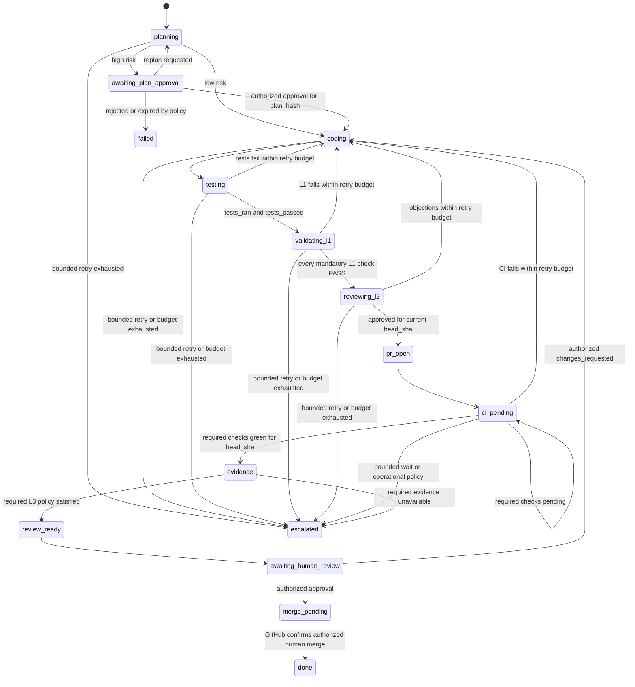

# DSE remediation — canonical execution specification

Status: **frozen for remediation sprint 1**  
Effective date: 2026-07-21  
Source plan: `../../plano-desenvolvimento/05-PLANO-REMEDIACAO.md`

This document is the executable interpretation of the remediation plan. When
an older README, diagram, database value or implementation comment disagrees
with it, this specification wins until an explicit ADR changes it.

## 1. Non-negotiable invariants

1. A production process fails before polling work when an unsafe runtime,
   fixture credential, development secret, missing enforcement dependency or
   disabled worker-versioning control is detected.
2. Agent SDK code and untrusted tools execute only in a stage-scoped sandbox.
   The Temporal worker dispatches a typed execution contract; it does not call
   the agent SDK in its own process.
3. PostgreSQL is the operational system of record. The audit ledger records
   immutable history but is never used as a substitute for current state.
4. Every plan, validation result, CI observation, review and merge decision is
   tied to immutable `base_sha` and `head_sha` values.
5. `SKIPPED`, `ERROR` and `NOT_CONFIGURED` never authorize progression.
6. A new `head_sha` invalidates L1, L2, L3 and CI evidence from every previous
   SHA.
7. Human signals are authorized server-side and bound to the relevant plan
   hash, repository, PR and/or head SHA. Payload headers supplied by a sandbox
   are not authority.
8. Retries are bounded and idempotent. They must not duplicate model cost,
   commits, pushes, PRs, terminal events or audit rows.

## 2. Canonical state machine

`changes_requested` is an event, not a terminal state. It returns the same
WorkItem to `coding` while preserving the branch and PR number. A subsequent
commit updates `head_sha` and invalidates earlier evidence.

The public API may project these detailed states to coarse `running`,
`blocked`, `done` and `failed` values, but the database and workflow must keep
the detailed state without inference from audit actions.

## 3. Allowed gate outcomes

| Outcome | Meaning | May advance? |
|---|---|---:|
| `PASS` | The required check ran and met its policy | Yes |
| `FAIL` | The check ran and found a policy violation | No |
| `SKIPPED` | Policy explicitly did not execute the check | No |
| `ERROR` | Infrastructure/tooling prevented a reliable result | No |
| `NOT_CONFIGURED` | No trusted repository configuration exists | No |

Legacy boolean `passed` fields remain readable while histories are migrated,
but new decisions must be derived from the structured outcome. `passed=true`
is valid only when the outcome is `PASS`.

## 4. Evidence manifest

Every consequential stage persists the following before the next stage starts:

| Stage | Required durable fields |
|---|---|
| Admission | tenant, requester, repo, base branch, budget, intake identity |
| Planning | plan, `plan_hash`, `expected_files`, effective risk, `base_sha` |
| Coding/testing | sandbox/lease, attempts, changed files, `head_sha`, cost |
| L1 | outcome per command, exit code, duration, artifact hash, base/head SHA |
| L2 | model/version, structured findings, cost, plan hash, head SHA |
| PR/CI | branch, PR number/URL, required checks and status, head SHA |
| L3 | preview/report/video/trace references and checksums, head SHA |
| Merge | GitHub-confirmed merged SHA, authorized human identity, timestamp |

No stage may infer `base_sha` from a local branch name. Git comparisons use
`git diff <base_sha>...<head_sha>` after verifying that both objects exist.

## 5. Temporal payload evolution

- Activity inputs are additive. New fields have safe defaults while historical
  payloads may still exist in workflow history.
- A missing historical field is resolved server-side from PostgreSQL using the
  WorkItem identifier; it is not invented by a model or default fixture.
- A required value that cannot be resolved produces a typed, bounded failure.
- Every shape change adds a literal-payload compatibility test and a replay
  test using a history written by the previous shape.
- Test fakes decode activity payloads with the real Pydantic input model before
  returning. Dictionary access that bypasses decoding is prohibited.

## 6. Retry and wait policy

- Activity retries distinguish retryable infrastructure failures from permanent
  policy/contract failures.
- Every loop has an attempt cap, wall-clock cap and cost cap where model calls
  are involved.
- Long-running activities heartbeat frequently enough to detect worker loss in
  approximately one minute. The heartbeat carries only non-sensitive progress.
- CI `pending` is a durable wait, never success. Webhooks are reconciled with
  idempotent polling and duplicate/out-of-order events are harmless.
- Exhaustion ends in `failed` or `escalated` with a persisted reason; no retry
  loop is infinite.

## 7. Production admission profile

Production/pilot startup is denied when any of these conditions is true:

- in-process or local fallback execution is enabled;
- an agent substrate, virtual key or provider credential is a fixture;
- the orchestrator has a Docker socket, host workspace, provider master key or
  GitHub App private key;
- Vault development mode/default secrets are enabled;
- model gateway, egress proxy, credential broker or durable ledger is absent;
- worker versioning is disabled or uses a mutable/development build ID;
- sandbox RuntimeClass, default-deny network policy or mandatory resource
  limits are absent;
- workload images are mutable or not pinned to an approved digest.

Development conveniences require an explicit `dev` or `test` profile. Merely
omitting `DSE_ENVIRONMENT` never selects production and never weakens a profile
that explicitly declares itself as production.

## 8. Change control

Changes to this specification require:

1. an ADR describing the compatibility and security impact;
2. updates to contract, replay and transition-table tests;
3. an additive migration when durable state changes; and
4. approval from architecture, platform and security owners.
