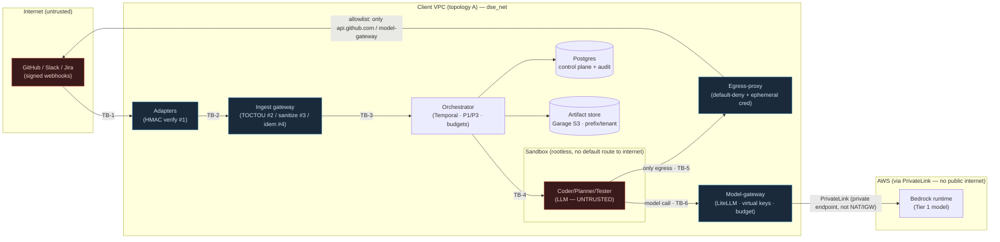
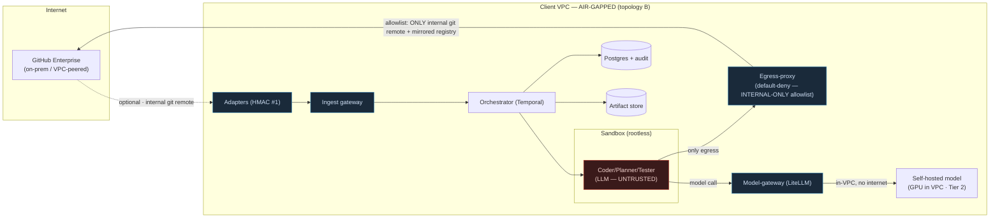

# Fintex DSE — Threat model (WSF-E8-T1, Phase 4)

Owner: WS-F (security/platform). Status: **pilot gate package "client security/data
review passed"**. Consolidates §12.1 of the technical proposal against the REAL state of the code
as built (Phases 1-4), under the P8 discipline (evidence over assertion): every threat below maps
to an **implemented** control (with the file cited) and to a **test** that covers it. Where a
control is partial, fixture-based, or depends on a real credential/infra that is still missing,
that is stated explicitly — not hidden (P6/P8).

This document does not describe aspirational controls. If a control does not exist in the code, it
shows up in the "Honest gap" column and not in "Implemented control".

Last verification of the referenced suite: 503 tests passing (addendum 03 §Part 1) + the red-team
suite from this phase (`services/platform/tests/test_red_team.py`, WSF-E8-T3).

---

## 1. Scope, trust boundaries and assumptions

The DSE receives work requests from humans over chat/ticket surfaces (Slack/GitHub/Jira),
runs an LLM agent in a sandbox to produce a diff, validates it deterministically and opens a PR
for **human review and merge**. No flow decision is made by an LLM (P1); no producer approves its
own work (P3).

**Trust boundaries (where data crosses a trust level):**

- **TB-1 Internet → Adapter**: a webhook from an external platform enters the adapter. The attacker
  controls the body/headers. Defended by signature verification (defense #1).
- **TB-2 Adapter → Ingest gateway**: the normalized event enters the transactional control plane.
  Defended by TOCTOU snapshot (#2), sanitization (#3), idempotency (#4).
- **TB-3 Ingest → Orchestrator (Temporal)**: durable `StartWorkflow`. Only the dispatcher writes.
- **TB-4 Orchestrator → Sandbox**: the LLM agent runs here. **This is the least trusted component in
  the system** — we assume the model can be tricked (prompt injection). Contained by
  network isolation + default-deny egress-proxy.
- **TB-5 Sandbox → Egress-proxy → Internet**: the only outbound route. Default-deny + ephemeral
  credentials injected at the edge.
- **TB-6 Sandbox/services → Model-gateway**: the only route to a model call. Virtual keys
  per tenant/task/stage.
- **TB-7 Any service → Postgres/Artifact store**: multi-tenant data. Isolation by
  tenant_id + prefix, fail-closed.
- **TB-8 Human → Admin console (queue board)**: operator controls. SSO/OIDC + audit.

**Trust assumptions (documented for the client's security reviewer):**

1. Postgres, Temporal, Vault and the `dse_net`/VPC network are trusted infrastructure operated by
   the client (topology A) or by the DSE operator. An attacker with root on the infra host is out
   of scope for this document's threat model (that is the client's platform operations threat model).
2. The LLM model is **not** trusted with respect to control flow: any text that reaches the model
   context (including the user's `content_snapshot` and repository content) may
   contain adversarial instructions (OWASP LLM01). Containment is structural (egress + P1), not
   trust in model alignment.
3. Real credentials (GitHub App, Slack, Jira, AWS-Bedrock) **do not exist yet in this session**
   — several controls are exercised with an env/fixture secret. This is flagged per control.

---

## 2. Threat → implemented control → test matrix

Ordered by component as requested (adapters, ingest, orchestrator, sandbox,
egress-proxy, model-gateway, artifact store, queue board). "State" ∈ {**Implemented**,
**Partial**, **Fixture**}, with the reason always cited.

### 2.1 Adapters (`services/adapter-slack|github|jira/`) — TB-1

| Threat | Implemented control (file) | Test | State |
|---|---|---|---|
| **Forged task injection** (forged webhook without a valid signature) | Mandatory HMAC-SHA256 before any processing; `signature_verified=False` ⇒ 401 + audit. `ingest_gateway/security.py::verify_slack_signature/verify_github_signature/verify_jira_signature` | `adapter-slack/tests/test_signature_pipeline.py`, `adapter-github/tests/test_signature_pipeline.py`, `ingest-gateway/tests/test_security.py`; red-team: `test_red_team.py::TestForgedWebhook` | **Implemented** (production logic; secret read from env/Vault — real once the apps exist) |
| **Replay** (valid webhook re-sent) | 5-minute replay window over the signed timestamp (Slack); idempotency by `event_id` downstream. `security.py::REPLAY_WINDOW_SECONDS`; idempotent Jira poller | `ingest-gateway/tests/test_security.py`, `adapter-jira/tests/test_poller_webhook_idempotency.py` | **Implemented** |
| **Post-hoc injection** (editing the message/ticket after admission) | TOCTOU snapshot: `content_snapshot` is frozen at admission and never rewritten; later edits do not change the audited snapshot. `ingest_gateway/gateway.py::_payload_json` (comment WSA-E2-T2) | `ingest-gateway/tests/test_gateway.py` | **Implemented** |
| **Tenant confusion** (event from one workspace mapped to the wrong tenant) | `tenant_platform_bindings` (migration 0008); deterministic platform→tenant resolution. `ingest_gateway/tenant_binding.py` | `ingest-gateway/tests/test_tenant_binding.py`, `adapter-github/tests/test_merge_and_tenant.py` | **Implemented** |

### 2.2 Ingest gateway (`services/ingest-gateway/`) — TB-2/TB-3

| Threat | Implemented control (file) | Test | State |
|---|---|---|---|
| **Indirect prompt injection / OWASP LLM01** (adversarial instructions in the user's body) | Defense-in-depth sanitization: strip invisible/bidi Unicode + redact secret patterns BEFORE any model call. **The real containment is egress (2.5), not this** — documented in the module itself. `ingest_gateway/sanitize.py::sanitize_content` | `ingest-gateway/tests/test_sanitize.py`; red-team: `test_red_team.py::TestPromptInjection` | **Partial by design** (mitigation, not containment — the module says so explicitly) |
| **Duplicate triggers** (same event processed twice, two workflows) | Transactional idempotency: `INSERT ... ON CONFLICT (idempotency_key) DO NOTHING`; dispatcher `SELECT ... FOR UPDATE SKIP LOCKED`. `gateway.py::admit_work_item`, `dispatcher.py` | `ingest-gateway/tests/test_gateway.py`, `test_dispatcher.py` | **Implemented** (real Postgres, not mocked — P8) |
| **Forged steering / privilege confusion** (unauthorized user redirects a task) | Steering is only accepted from a principal on the work item's allowlist (fallback) OR in the real identity map (WSF-E3). `ingest_gateway/steering.py`, `dse_platform/steering_resolution.py::is_steering_allowed` | `ingest-gateway/tests/test_steering.py` | **Implemented** |
| **Kill switch bypass** (admitting work while the system is paused) | Admission checks the global/tenant/channel kill switch before admitting. `ingest_gateway/kill_switch.py` → `dse_platform/kill_switches.py::is_admission_blocked` | `platform/tests/test_kill_switches.py` | **Implemented** |

### 2.3 Orchestrator (`services/orchestrator/`) — TB-3/TB-4

| Threat | Implemented control (file) | Test | State |
|---|---|---|---|
| **Automatic merge / producer approves its own work (P1/P3)** | No workflow path calls merge; `approved` only becomes `Done` after an explicit `merged_by_human` signal. Verified **statically** (grep over the source) + at runtime. `orchestrator/workflow.py` | `orchestrator/tests/test_review_loop.py::test_no_automatic_merge_path_in_source` + `test_approved_waits_for_explicit_merge_signal` | **Implemented** (static + durable invariant) |
| **Silent budget overrun (P6)** | Decline-never-truncate: budget exceeded ⇒ clean failure at a boundary + pause, never a mid-stream cut. `orchestrator/workflow.py` budgets | `orchestrator/tests/test_budgets.py`, `test_iteration_caps_debounce.py` | **Implemented** |
| **Cross-tenant resource starvation (fairness)** | Worker-side per-tenant concurrency cap, deterministic namespacing key. `dse_platform/tenant_isolation.py::fairness_key` | `orchestrator/tests/test_fairness.py`, `platform/tests/test_tenant_isolation.py` | **Implemented** (Temporal's native Priority&Fairness unavailable <1.31 — worker-side, behind a swappable interface) |
| **Loss of durability on crash** | Checkpoint/recovery via Temporal; deterministic replay. Chaos suite. `orchestrator/` | `orchestrator/tests/test_chaos.py` | **Implemented** (real Temporal, not mocked) |
| **Base drift / orphaned review threads** (rebase+force-push orphans anchored threads — failure mode 11) | merge-base-into-branch by default; rebase ONLY before the 1st human review. Exit assertion: 0 orphaned threads. `ACTIVITY_UPDATE_BASE_BRANCH`, owned by WS-E (WSE-E6-T16) | contract: `packages/contracts/dse_contracts/activities.py::UpdateBaseBranchInput` (`first_human_review_done=True` safe default); WS-E tests | **Implemented in the contract; impl. WS-E Phase 4** (new construction — addendum 03 finding #2) |

### 2.4 Sandbox runtime (`services/sandbox-runtime/`) — TB-4 (least trusted component)

| Threat | Implemented control (file) | Test | State |
|---|---|---|---|
| **Network exfiltration from the sandbox** | Docker network isolation: the sandbox has NO default route to the internet; the only way out is the egress-proxy. Rootless driver. `sandbox_runtime/` Docker driver | `sandbox-runtime/tests/test_network_isolation.py::test_sandbox_isolation_and_egress_proxy_only_route` | **Implemented** (real Docker) |
| **Sandbox escape / resource abuse** | CPU/memory/PID caps; rootless; deterministic teardown. `sandbox_runtime/` | `sandbox-runtime/tests/test_resource_caps_and_metrics.py` | **Implemented** |
| **Malicious skill loaded from another tenant** | The planner only reads `skill_registry` rows of its own tenant with `status='approved'` (tenant_id hardcoded in the query, no "all" parameter). `sandbox_runtime/skill_registry.py::read_approved_skills` | `sandbox-runtime/tests/test_skill_registry.py`; red-team: `test_red_team.py::TestCrossTenant::test_skill` | **Implemented** |
| **Cross-tenant retrieval** (repo context from another tenant) | Retrieval query scoped by tenant_id, fail-closed. `dse_platform/tenant_isolation.py::query_retrieval_scoped` | `sandbox-runtime/tests/test_retrieval.py`, `platform/tests/test_tenant_isolation.py` | **Implemented** |
| **Skill self-promotes / promotion without an approver (P3)** | Transition to `approved`/`active` refused with an empty `approver`; an eval with a negative regression blocks by construction. Contract `PromoteSkillInput`/`EvalSkillCandidateResult.negative_regressions`; impl. WS-C (WSC-E4-T3) | contract: `activities.py`; red-team: `test_red_team.py::TestMaliciousSkill` (wires up to WS-C, skips if the activity is not up yet) | **Contract implemented; impl. WS-C Phase 4** |

### 2.5 Egress-proxy (`services/egress-proxy/`) — TB-5 (the real containment)

| Threat | Implemented control (file) | Test | State |
|---|---|---|---|
| **Exfiltration to an arbitrary host** (tricked LLM tries to POST to pastebin/telegram/etc.) | Default-deny: only hosts explicitly on the allowlist derived from the work item get through; everything else is refused (never a silent forward). `egress_proxy/allowlist.py::Allowlist.is_allowed`, `proxy.py` | `egress-proxy/tests/test_allowlist_and_audit.py`; red-team: `test_red_team.py::TestEgressExfil` (SSRF metadata, telegram, pastebin, host-confusion bypass) | **Implemented** (real proxy live on :8806 — verified in this session) |
| **SSRF to cloud metadata** (169.254.169.254) | Not on the allowlist ⇒ default-deny. Same control as above | `platform/tests/test_egress_proxy_adversarial.py::TestAllowlistEnforcement`; red-team `TestEgressExfil` | **Implemented** |
| **Allowlist bypass** (confusing suffix, decimal/hex IP, IPv4-mapped IPv6, userinfo) | Exact host match, not suffix; the parser rejects malformed URLs. `allowlist.py` | `platform/tests/test_egress_proxy_adversarial.py::TestBypassAttempts`; red-team `TestEgressExfil` | **Implemented** |
| **Credential theft/replay** (token captured inside the sandbox and reused) | Ephemeral credentials injected at the proxy edge, never persisted in the sandbox; leases with TTL. `egress_proxy/credentials.py`, `leases_store.py` | `egress-proxy/tests/test_credential_injection_and_revocation.py` | **Implemented** (injection/revocation); direct replay against a real upstream = pending cross-WS integration test (documented as an honest gap in `test_egress_proxy_adversarial.py::TestCredentialReuse`) |
| **Model credential leaking to an external provider** | The ONLY allowlist entry for a model call is the model-gateway; no `api.anthropic.com`/`api.openai.com`/`bedrock-runtime.*` is ever added. `allowlist.py::Allowlist.for_work_item` (docstring) | `egress-proxy/tests/test_model_gateway_only_allowlist.py` | **Implemented** |

### 2.6 Model-gateway (`services/model-gateway/`) — TB-6

| Threat | Implemented control (file) | Test | State |
|---|---|---|---|
| **Using another tenant's key** | Virtual key per tenant/task/stage; ownership validation. `dse_platform/tenant_isolation.py::assert_token_belongs_to_tenant`; `virtual_keys` table (migration 0011) | `platform/tests/test_tenant_isolation.py::test_token_belongs_to_tenant`; red-team `TestCrossTenant::test_token` | **Implemented** |
| **Per-tenant budget overrun (P6)** | Policy/budget enforcement at call time; clean refusal in the contract's error format. `model-gateway/` | `model-gateway/tests/test_budget_enforcement.py`, `test_policy_enforcement.py` | **Implemented** |
| **Call to a disallowed model/tier** | Per-tenant model allowlist; Bedrock/PrivateLink tier as an entry. `model-gateway/` | `model-gateway/tests/test_conformance_gateway_only.py`, `test_policy_enforcement.py` | **Implemented** (against an echo/fixture provider — real Bedrock pending an AWS account, addendum 03 §Part 3) |
| **Gateway kill switch not honored** | The kill switch reassigns/refuses calls. `model-gateway/` | `model-gateway/tests/test_kill_switch_reassign.py` | **Implemented** |
| **Loss of the cost trail (economics)** | Durable per-call cost ledger. `model-gateway/` | `model-gateway/tests/test_ledger_durable.py`, `test_cost_export.py` | **Implemented** (real numbers depend on real traffic — administrative pilot gate) |

### 2.7 Artifact store (Garage S3, `services/validation/` + WS-F policy) — TB-7

| Threat | Implemented control (file) | Test | State |
|---|---|---|---|
| **Cross-tenant artifact access** | Per-tenant prefix (`tenants/<tenant>/...`); path traversal (`../`) rejected. `dse_platform/tenant_isolation.py::artifact_key/artifact_prefix` | `platform/tests/test_tenant_isolation.py::test_artifact_prefix_per_tenant/test_artifact_key_rejects_path_traversal`; red-team `TestCrossTenant::test_artifact_prefix` | **Implemented** |
| **Leaked / never-expiring evidence link** | Short-TTL presigned URL; policy-driven expiration. `ArtifactRef.expires_at` (contract); `validation/` artifact store | `validation/tests/test_artifact_store.py`, `test_evidence_publication.py` | **Implemented** |
| **Retention beyond the data classification** | Per-data_class retention policy; scheduled job. `dse_platform/retention.py::run_retention` | `platform/tests/test_retention.py` | **Implemented** |
| **Quarantine not enforced** (suspicious artifact served) | Work item quarantine blocks it. `dse_platform/kill_switches.py::quarantine_work_item` | `platform/tests/test_kill_switches.py` | **Implemented** |

### 2.8 Queue board / admin console (`services/platform/dse_platform/queue_board/`) — TB-8

| Threat | Implemented control (file) | Test | State |
|---|---|---|---|
| **Unauthenticated access to the console** | Login via SSO/OIDC; with no IdP configured, login is disabled (503) — never open. `dse_platform/sso.py::login/OIDCVerifier` | `platform/tests/test_sso.py`, `test_queue_board_app.py` | **Partial** (real OIDC verifier; no real IdP in this session ⇒ 503 by design — see README "Honest gaps") |
| **Operator sees another tenant's queue** | Board queries scoped by tenant. `queue_board/` + `tenant_isolation.py` | `platform/tests/test_queue_board.py` | **Implemented** |
| **Operator action without a trail (P8)** | Every consequential action (kill switch, quarantine, release) goes through `dse_audit.emit`. `queue_board/`, `kill_switches.py` | `platform/tests/test_kill_switches.py`, `test_queue_board.py` | **Implemented** |
| **Offboarding does not revoke the session** | `offboard()` invalidates the console session. `sso.py::offboard/is_console_active` | `platform/tests/test_sso.py` | **Implemented** |

### 2.9 Cross-cutting threats

| Threat | Implemented control (file) | Test | State |
|---|---|---|---|
| **Cross-tenant leak (any layer)** | Central fail-closed guard that raises `CrossTenantViolation` + audits `cross_tenant_access_denied` (does not even leak the resource's existence). `dse_platform/tenant_isolation.py::guard_same_tenant` | `platform/tests/test_tenant_isolation.py` (6 layers); red-team `TestCrossTenant` | **Implemented** |
| **Plaintext secret in the repo/config** | Static plaintext-secret scanner in CI. `services/platform/scripts/scan_for_plaintext_secrets.py` | `platform/tests/test_scan_for_plaintext_secrets.py` | **Implemented** |
| **Service secret never rotated** | Scheduled rotation (ADR-28) via the jobs scheduler + ESO in preview. `dse_platform/secret_rotation.py`, `jobs_scheduler.py` | `platform/tests/test_secret_rotation.py`, `test_eso_preview_secrets.py` | **Implemented** (dev Vault; production uses the client's Vault/HSM) |
| **Supply-chain drift** (OSS dependency tampered with/vulnerable) | Versioned OSS BOM + upgrade runbook; images pinned by tag in Helm. `infra/OSS-BOM.md`, `infra/RUNBOOK-UPGRADE.md`, `infra/helm/dse/values.yaml` (pinned tags) | chart validation: `helm lint`/`helm template` (README §6) | **Partial** (manual BOM; **honest gap:** no image signing/automated SBOM and no CVE scanning in CI — manual item of RED-TEAM-PROGRAM §5) |
| **Tampered audit ledger** | Partitioned append-only `audit_log`; no UPDATE/DELETE GRANT for `dse_app` (verified in addendum 03). Migration 0001 | `packages/dse_audit/tests/test_audit_client.py`, `test_queries.py` | **Implemented** |

---

## 3. Data-flow diagrams by model tier

Two model-gateway deployment tiers with distinct risk profiles. Both share the
same application data plane (adapters → ingest → orchestrator → sandbox); they differ in **how the
sandbox reaches a model** and where the inference data resides.

### 3.1 Tier 1 — Bedrock PrivateLink (data never leaves the client's VPC over the public internet)

**Tier 1 security property:** the prompt and the completion travel from the model-gateway to
Bedrock over a private PrivateLink endpoint inside the VPC — they do not cross the public internet
nor a NAT/Internet Gateway. The egress-proxy does **not** have `bedrock-runtime.*` on the sandbox
allowlist; the sandbox only talks to the model-gateway, and it is the model-gateway (not the
sandbox) that speaks PrivateLink. This keeps the model credential out of the untrusted component
(the sandbox).

### 3.2 Tier 2 — Air-gapped (self-hosted model in the VPC, no external egress at all — P2)

**Tier 2 security property:** no inference data leaves the VPC — the model runs
in-VPC (dedicated GPU). The egress allowlist contains only the internal git remote and a
**mirrored** package registry (not public pypi.org). This is the strictest tier and maps 1:1 onto
topology B (see `infra/helm/dse/TOPOLOGY-B.md`). **State:** the custom provider mechanism is
already proven (echo provider, `model-gateway/tests/test_echo_provider.py`); the concrete
air-gapped provider is P2 (WSD-E5-T2/T3) and does not block the pilot (addendum 03 §Part 2 #5).

---

## 4. Summary of honest gaps (P8)

What is NOT fully contained in the code today — so the client's security reviewer sees it
without having to go looking:

1. **Real credentials missing**: GitHub App/Slack/Jira/AWS-Bedrock. Signature verification, virtual
   keys and PrivateLink have the production logic, but are exercised with an env/fixture/echo
   secret. The "economics/PR quality with real numbers" pilot gate depends on this (addendum 03
   §Part 3 — administrative item, longest lead time).
2. **Prompt injection is mitigated, not contained, at the sanitization layer** — the real
   containment is the default-deny egress (2.5). This is intentional and documented in the module
   itself.
3. **Direct replay of a captured credential against a real upstream** is not testable against the
   proxy's HTTP interface alone — it needs a cross-WS integration test (WS-C + WS-F). Documented
   in `test_egress_proxy_adversarial.py::TestCredentialReuse`.
4. **Supply-chain**: manual BOM, no image signing/SBOM/automated CVE scanning in CI.
   Manual item of RED-TEAM-PROGRAM (§5).
5. **Console SSO** runs with a real OIDC verifier but no real IdP (503 by design in this
   session). See README "Honest gaps".
6. **merge-base / skill promotion**: contracts are defined and the red-team wires up to them, but
   the implementation belongs to WS-E/WS-C in this same Phase 4 (in parallel). The red-team tests
   skip with a clear reason if the activity is not up yet.

None of these gaps is a silent fail-open — all of them fail closed (P6) and are audited (P8).
