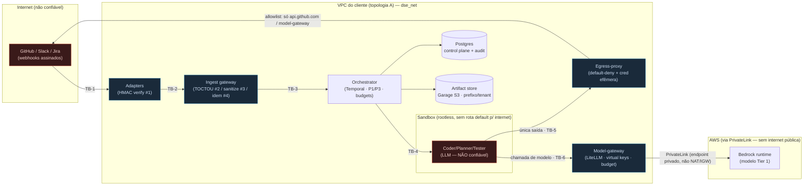
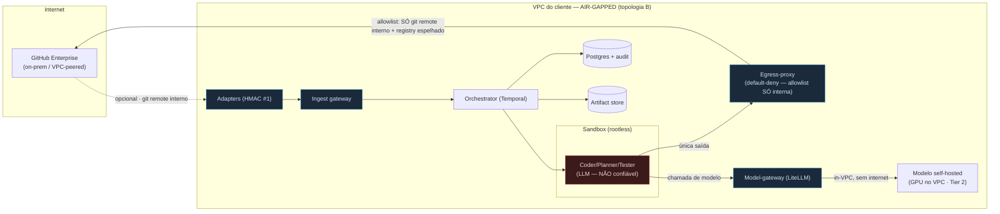

# Fintex DSE — Threat model (WSF-E8-T1, Fase 4)

Dono: WS-F (segurança/plataforma). Status: **pacote do pilot gate "client security/data
review passed"**. Consolida o §12.1 da proposta técnica no estado REAL do código construído
(Fases 1-4), com a disciplina P8 (evidência sobre asserção): cada ameaça abaixo é mapeada a um
controle **implementado** (arquivo citado) e a um **teste** que o cobre. Onde um controle é
parcial, fixture, ou depende de credencial/infra real ainda ausente, isso está dito
explicitamente — não escondido (P6/P8).

Este documento não descreve controles aspiracionais. Se um controle não existe no código, ele
aparece na coluna "Gap honesto" e não em "Controle implementado".

Última verificação da suíte referenciada: 503 testes passando (adendo 03 §Parte 1) + a suíte de
red-team desta fase (`services/platform/tests/test_red_team.py`, WSF-E8-T3).

---

## 1. Escopo, trust boundaries e premissas

O DSE recebe pedidos de trabalho de humanos via superfícies de chat/ticket (Slack/GitHub/Jira),
roda um agente LLM em sandbox para produzir um diff, valida-o deterministicamente e abre um PR
para **review e merge humano**. Nenhuma decisão de fluxo é tomada por LLM (P1); nenhum produtor
aprova o próprio trabalho (P3).

**Trust boundaries (onde dado atravessa um nível de confiança):**

- **TB-1 Internet → Adapter**: webhook de plataforma externa entra no adapter. Atacante controla
  o corpo/headers. Defendido por verificação de assinatura (defesa #1).
- **TB-2 Adapter → Ingest gateway**: evento normalizado entra no control plane transacional.
  Defendido por TOCTOU snapshot (#2), sanitização (#3), idempotência (#4).
- **TB-3 Ingest → Orchestrator (Temporal)**: `StartWorkflow` durável. Só o dispatcher escreve.
- **TB-4 Orchestrator → Sandbox**: o agente LLM roda aqui. **É o componente menos confiável do
  sistema** — assume-se que o modelo pode ser enganado (prompt injection). Contido por
  isolamento de rede + egress-proxy default-deny.
- **TB-5 Sandbox → Egress-proxy → Internet**: única rota de saída. Default-deny + credenciais
  efêmeras injetadas na borda.
- **TB-6 Sandbox/serviços → Model-gateway**: única rota para chamada de modelo. Virtual keys
  por tenant/task/stage.
- **TB-7 Qualquer serviço → Postgres/Artifact store**: dado multi-tenant. Isolamento por
  tenant_id + prefixo, fail-closed.
- **TB-8 Humano → Admin console (queue board)**: controles de operador. SSO/OIDC + audit.

**Premissas de confiança (documentadas para o revisor de segurança do cliente):**

1. O Postgres, Temporal, Vault e a rede `dse_net`/VPC são infra confiável operada pelo cliente
   (topologia A) ou pelo operador do DSE. Um atacante com root no host de infra está fora do
   modelo de ameaça deste documento (é o modelo de ameaça de operações de plataforma do cliente).
2. O modelo LLM **não** é confiável quanto a fluxo de controle: qualquer texto que chegue ao
   contexto do modelo (incluindo `content_snapshot` do usuário e conteúdo de repositório) pode
   conter instruções adversariais (OWASP LLM01). A contenção é estrutural (egress + P1), não
   confiança no alinhamento do modelo.
3. As credenciais reais (GitHub App, Slack, Jira, AWS-Bedrock) **ainda não existem nesta sessão**
   — vários controles são exercitados com segredo de env/fixture. Isso está marcado por controle.

---

## 2. Matriz de ameaças → controle implementado → teste

Ordenada por componente conforme o pedido (adapters, ingest, orchestrator, sandbox,
egress-proxy, model-gateway, artifact store, queue board). "Estado" ∈ {**Implementado**,
**Parcial**, **Fixture**} com a razão sempre citada.

### 2.1 Adapters (`services/adapter-slack|github|jira/`) — TB-1

| Ameaça | Controle implementado (arquivo) | Teste | Estado |
|---|---|---|---|
| **Forged task injection** (webhook forjado sem assinatura válida) | HMAC-SHA256 obrigatório antes de qualquer processamento; `signature_verified=False` ⇒ 401 + audit. `ingest_gateway/security.py::verify_slack_signature/verify_github_signature/verify_jira_signature` | `adapter-slack/tests/test_signature_pipeline.py`, `adapter-github/tests/test_signature_pipeline.py`, `ingest-gateway/tests/test_security.py`; red-team: `test_red_team.py::TestForgedWebhook` | **Implementado** (lógica de produção; segredo lido de env/Vault — real quando as apps existirem) |
| **Replay** (webhook válido reenviado) | Janela de replay de 5 min sobre o timestamp assinado (Slack); idempotência por `event_id` downstream. `security.py::REPLAY_WINDOW_SECONDS`; Jira poller idempotente | `ingest-gateway/tests/test_security.py`, `adapter-jira/tests/test_poller_webhook_idempotency.py` | **Implementado** |
| **Post-hoc injection** (editar a mensagem/ticket depois de admitida) | Snapshot TOCTOU: `content_snapshot` é congelado na admissão e nunca reescrito; edições posteriores não alteram o snapshot auditado. `ingest_gateway/gateway.py::_payload_json` (comentário WSA-E2-T2) | `ingest-gateway/tests/test_gateway.py` | **Implementado** |
| **Confusão de tenant** (evento de um workspace mapeado ao tenant errado) | `tenant_platform_bindings` (migração 0008); resolução determinística plataforma→tenant. `ingest_gateway/tenant_binding.py` | `ingest-gateway/tests/test_tenant_binding.py`, `adapter-github/tests/test_merge_and_tenant.py` | **Implementado** |

### 2.2 Ingest gateway (`services/ingest-gateway/`) — TB-2/TB-3

| Ameaça | Controle implementado (arquivo) | Teste | Estado |
|---|---|---|---|
| **Indirect prompt injection / OWASP LLM01** (instruções adversariais no corpo do usuário) | Sanitização defesa-em-profundidade: remoção de Unicode invisível/bidi + redação de padrões de secret ANTES de qualquer chamada de modelo. **Contenção real é o egress (2.5), não isto** — documentado no próprio módulo. `ingest_gateway/sanitize.py::sanitize_content` | `ingest-gateway/tests/test_sanitize.py`; red-team: `test_red_team.py::TestPromptInjection` | **Parcial por design** (mitigação, não contenção — o módulo diz isso explicitamente) |
| **Triggers duplicados** (mesmo evento processado 2×, dois workflows) | Idempotência transacional: `INSERT ... ON CONFLICT (idempotency_key) DO NOTHING`; dispatcher `SELECT ... FOR UPDATE SKIP LOCKED`. `gateway.py::admit_work_item`, `dispatcher.py` | `ingest-gateway/tests/test_gateway.py`, `test_dispatcher.py` | **Implementado** (Postgres real, não mockado — P8) |
| **Steering forjado / privilege confusion** (usuário não autorizado desvia uma tarefa) | Steering só aceito de principal na allowlist do work item (fallback) OU no identity map real (WSF-E3). `ingest_gateway/steering.py`, `dse_platform/steering_resolution.py::is_steering_allowed` | `ingest-gateway/tests/test_steering.py` | **Implementado** |
| **Bypass de kill switch** (admitir trabalho com o sistema pausado) | Admissão checa kill switch global/tenant/canal antes de admitir. `ingest_gateway/kill_switch.py` → `dse_platform/kill_switches.py::is_admission_blocked` | `platform/tests/test_kill_switches.py` | **Implementado** |

### 2.3 Orchestrator (`services/orchestrator/`) — TB-3/TB-4

| Ameaça | Controle implementado (arquivo) | Teste | Estado |
|---|---|---|---|
| **Merge automático / produtor aprova o próprio trabalho (P1/P3)** | Nenhum path do workflow chama merge; `approved` só vira `Done` após signal `merged_by_human` explícito. Verificado **estaticamente** (grep no source) + em runtime. `orchestrator/workflow.py` | `orchestrator/tests/test_review_loop.py::test_no_automatic_merge_path_in_source` + `test_approved_waits_for_explicit_merge_signal` | **Implementado** (invariante estático + durável) |
| **Estouro de budget silencioso (P6)** | Decline-never-truncate: excedeu budget ⇒ falha limpa em fronteira + pausa, nunca corta no meio. `orchestrator/workflow.py` budgets | `orchestrator/tests/test_budgets.py`, `test_iteration_caps_debounce.py` | **Implementado** |
| **Fome de recursos cross-tenant (fairness)** | Cap de concorrência por tenant worker-side, chave de namespacing determinística. `dse_platform/tenant_isolation.py::fairness_key` | `orchestrator/tests/test_fairness.py`, `platform/tests/test_tenant_isolation.py` | **Implementado** (Priority&Fairness nativo do Temporal indisponível <1.31 — worker-side, atrás de interface trocável) |
| **Perda de durabilidade em crash** | Checkpoint/recovery via Temporal; replay determinístico. Suíte de chaos. `orchestrator/` | `orchestrator/tests/test_chaos.py` | **Implementado** (Temporal real, não mockado) |
| **Base drift / threads de review órfãs** (rebase+force-push órfã threads ancoradas — failure mode 11) | merge-base-into-branch por default; rebase SÓ antes do 1º review humano. Asserção de exit: 0 threads órfãs. `ACTIVITY_UPDATE_BASE_BRANCH`, dono WS-E (WSE-E6-T16) | contrato: `packages/contracts/dse_contracts/activities.py::UpdateBaseBranchInput` (`first_human_review_done=True` default seguro); testes de WS-E | **Implementado no contrato; impl. WS-E Fase 4** (construção nova — adendo 03 achado #2) |

### 2.4 Sandbox runtime (`services/sandbox-runtime/`) — TB-4 (componente menos confiável)

| Ameaça | Controle implementado (arquivo) | Teste | Estado |
|---|---|---|---|
| **Exfiltração via rede a partir do sandbox** | Isolamento de rede Docker: sandbox NÃO tem rota default para a internet; única saída é o egress-proxy. Driver rootless. `sandbox_runtime/` driver Docker | `sandbox-runtime/tests/test_network_isolation.py::test_sandbox_isolation_and_egress_proxy_only_route` | **Implementado** (Docker real) |
| **Escape de sandbox / abuso de recurso** | Caps de CPU/memória/PIDs; rootless; teardown determinístico. `sandbox_runtime/` | `sandbox-runtime/tests/test_resource_caps_and_metrics.py` | **Implementado** |
| **Skill maliciosa carregada por outro tenant** | Planner só lê `skill_registry` do próprio tenant com `status='approved'` (tenant_id hardcoded na query, sem parâmetro "todos"). `sandbox_runtime/skill_registry.py::read_approved_skills` | `sandbox-runtime/tests/test_skill_registry.py`; red-team: `test_red_team.py::TestCrossTenant::test_skill` | **Implementado** |
| **Retrieval cross-tenant** (contexto de repo de outro tenant) | Query de retrieval escopada por tenant_id, fail-closed. `dse_platform/tenant_isolation.py::query_retrieval_scoped` | `sandbox-runtime/tests/test_retrieval.py`, `platform/tests/test_tenant_isolation.py` | **Implementado** |
| **Skill se auto-promove / promoção sem approver (P3)** | Transição para `approved`/`active` recusada com `approver` vazio; eval com regressão negativa bloqueia por construção. Contrato `PromoteSkillInput`/`EvalSkillCandidateResult.negative_regressions`; impl. WS-C (WSC-E4-T3) | contrato: `activities.py`; red-team: `test_red_team.py::TestMaliciousSkill` (liga com WS-C, skipa se a activity ainda não subiu) | **Contrato implementado; impl. WS-C Fase 4** |

### 2.5 Egress-proxy (`services/egress-proxy/`) — TB-5 (a contenção real)

| Ameaça | Controle implementado (arquivo) | Teste | Estado |
|---|---|---|---|
| **Exfiltração para host arbitrário** (LLM enganado tenta POST para pastebin/telegram/etc.) | Default-deny: só hosts explicitamente na allowlist derivada do work item passam; todo o resto recebe recusa (nunca forward silencioso). `egress_proxy/allowlist.py::Allowlist.is_allowed`, `proxy.py` | `egress-proxy/tests/test_allowlist_and_audit.py`; red-team: `test_red_team.py::TestEgressExfil` (SSRF metadata, telegram, pastebin, bypass por confusão de host) | **Implementado** (proxy real no ar :8806 — verificado nesta sessão) |
| **SSRF para cloud metadata** (169.254.169.254) | Não está na allowlist ⇒ default-deny. Mesmo controle acima | `platform/tests/test_egress_proxy_adversarial.py::TestAllowlistEnforcement`; red-team `TestEgressExfil` | **Implementado** |
| **Bypass de allowlist** (sufixo confuso, IP decimal/hex, IPv4-mapped IPv6, userinfo) | Match exato de host, não sufixo; parser rejeita URLs malformadas. `allowlist.py` | `platform/tests/test_egress_proxy_adversarial.py::TestBypassAttempts`; red-team `TestEgressExfil` | **Implementado** |
| **Roubo/replay de credencial** (token capturado dentro do sandbox e reusado) | Credenciais efêmeras injetadas na borda do proxy, nunca persistidas no sandbox; leases com TTL. `egress_proxy/credentials.py`, `leases_store.py` | `egress-proxy/tests/test_credential_injection_and_revocation.py` | **Implementado** (injeção/revogação); replay direto contra upstream real = teste de integração cross-WS pendente (documentado como gap honesto em `test_egress_proxy_adversarial.py::TestCredentialReuse`) |
| **Vazamento de credencial de modelo para provider externo** | A ÚNICA allowlist entry para chamada de modelo é o model-gateway; nenhum `api.anthropic.com`/`api.openai.com`/`bedrock-runtime.*` jamais é adicionado. `allowlist.py::Allowlist.for_work_item` (docstring) | `egress-proxy/tests/test_model_gateway_only_allowlist.py` | **Implementado** |

### 2.6 Model-gateway (`services/model-gateway/`) — TB-6

| Ameaça | Controle implementado (arquivo) | Teste | Estado |
|---|---|---|---|
| **Uso de key de outro tenant** | Virtual key por tenant/task/stage; validação de posse. `dse_platform/tenant_isolation.py::assert_token_belongs_to_tenant`; tabela `virtual_keys` (migração 0011) | `platform/tests/test_tenant_isolation.py::test_token_belongs_to_tenant`; red-team `TestCrossTenant::test_token` | **Implementado** |
| **Estouro de budget por tenant (P6)** | Enforcement de política/budget no call time; recusa limpa com formato de erro do contrato. `model-gateway/` | `model-gateway/tests/test_budget_enforcement.py`, `test_policy_enforcement.py` | **Implementado** |
| **Chamada a modelo/tier não permitido** | Allowlist de modelos por tenant; tier Bedrock/PrivateLink como entry. `model-gateway/` | `model-gateway/tests/test_conformance_gateway_only.py`, `test_policy_enforcement.py` | **Implementado** (contra provider echo/fixture — Bedrock real pendente de conta AWS, adendo 03 §Parte 3) |
| **Kill switch de gateway não honrado** | Kill switch reatribui/recusa chamadas. `model-gateway/` | `model-gateway/tests/test_kill_switch_reassign.py` | **Implementado** |
| **Perda de trilha de custo (economics)** | Ledger durável de custo por chamada. `model-gateway/` | `model-gateway/tests/test_ledger_durable.py`, `test_cost_export.py` | **Implementado** (números reais dependem de tráfego real — pilot gate administrativo) |

### 2.7 Artifact store (Garage S3, `services/validation/` + política WS-F) — TB-7

| Ameaça | Controle implementado (arquivo) | Teste | Estado |
|---|---|---|---|
| **Acesso cross-tenant a artefato** | Prefixo por tenant (`tenants/<tenant>/...`); path traversal (`../`) rejeitado. `dse_platform/tenant_isolation.py::artifact_key/artifact_prefix` | `platform/tests/test_tenant_isolation.py::test_artifact_prefix_per_tenant/test_artifact_key_rejects_path_traversal`; red-team `TestCrossTenant::test_artifact_prefix` | **Implementado** |
| **Link de evidência vazado / eterno** | Presigned URL de TTL curto; expiração por política. `ArtifactRef.expires_at` (contrato); `validation/` artifact store | `validation/tests/test_artifact_store.py`, `test_evidence_publication.py` | **Implementado** |
| **Retenção além da classificação de dado** | Política de retenção por data_class; job agendado. `dse_platform/retention.py::run_retention` | `platform/tests/test_retention.py` | **Implementado** |
| **Quarentena não aplicada** (artefato suspeito servido) | Quarentena de work item bloqueia. `dse_platform/kill_switches.py::quarantine_work_item` | `platform/tests/test_kill_switches.py` | **Implementado** |

### 2.8 Queue board / admin console (`services/platform/dse_platform/queue_board/`) — TB-8

| Ameaça | Controle implementado (arquivo) | Teste | Estado |
|---|---|---|---|
| **Acesso não autenticado ao console** | Login via SSO/OIDC; sem IdP configurado o login fica desabilitado (503) — nunca aberto. `dse_platform/sso.py::login/OIDCVerifier` | `platform/tests/test_sso.py`, `test_queue_board_app.py` | **Parcial** (verificador OIDC real; sem IdP real nesta sessão ⇒ 503 por design — ver README "Gaps honestos") |
| **Operador vê fila de outro tenant** | Queries do board escopadas por tenant. `queue_board/` + `tenant_isolation.py` | `platform/tests/test_queue_board.py` | **Implementado** |
| **Ação de operador sem trilha (P8)** | Toda ação consequente (kill switch, quarentena, release) via `dse_audit.emit`. `queue_board/`, `kill_switches.py` | `platform/tests/test_kill_switches.py`, `test_queue_board.py` | **Implementado** |
| **Offboarding não revoga sessão** | `offboard()` invalida sessão do console. `sso.py::offboard/is_console_active` | `platform/tests/test_sso.py` | **Implementado** |

### 2.9 Ameaças cross-cutting

| Ameaça | Controle implementado (arquivo) | Teste | Estado |
|---|---|---|---|
| **Vazamento cross-tenant (qualquer camada)** | Guard central fail-closed que levanta `CrossTenantViolation` + audita `cross_tenant_access_denied` (não vaza nem existência do recurso). `dse_platform/tenant_isolation.py::guard_same_tenant` | `platform/tests/test_tenant_isolation.py` (6 camadas); red-team `TestCrossTenant` | **Implementado** |
| **Secret em texto plano no repo/config** | Scanner estático de plaintext secrets no CI. `services/platform/scripts/scan_for_plaintext_secrets.py` | `platform/tests/test_scan_for_plaintext_secrets.py` | **Implementado** |
| **Secret de serviço nunca rotacionado** | Rotação agendada (ADR-28) via jobs scheduler + ESO em preview. `dse_platform/secret_rotation.py`, `jobs_scheduler.py` | `platform/tests/test_secret_rotation.py`, `test_eso_preview_secrets.py` | **Implementado** (Vault dev; produção usa Vault/HSM do cliente) |
| **Supply-chain drift** (dependência OSS alterada/vulnerável) | BOM de OSS versionada + runbook de upgrade; imagens pinadas por tag no Helm. `infra/OSS-BOM.md`, `infra/RUNBOOK-UPGRADE.md`, `infra/helm/dse/values.yaml` (tags pinadas) | validação de chart: `helm lint`/`helm template` (README §6) | **Parcial** (BOM manual; **gap honesto:** sem assinatura de imagem/SBOM automatizado nem scan de CVE no CI — item manual do RED-TEAM-PROGRAM §5) |
| **Audit ledger adulterado** | `audit_log` append-only particionado; sem GRANT de UPDATE/DELETE para `dse_app` (verificado no adendo 03). Migração 0001 | `packages/dse_audit/tests/test_audit_client.py`, `test_queries.py` | **Implementado** |

---

## 3. Data-flow diagrams por tier de modelo

Dois tiers de deployment do model-gateway com perfis de risco distintos. Ambos compartilham o
mesmo data plane de aplicação (adapters → ingest → orchestrator → sandbox); diferem em **como o
sandbox alcança um modelo** e onde o dado de inferência reside.

### 3.1 Tier 1 — Bedrock PrivateLink (dado nunca sai do VPC do cliente pela internet pública)

**Propriedade de segurança do Tier 1:** o prompt e a completion trafegam do model-gateway para o
Bedrock por um endpoint PrivateLink privado dentro do VPC — não atravessam a internet pública nem
um NAT/Internet Gateway. O egress-proxy **não** tem `bedrock-runtime.*` na allowlist do sandbox;
o sandbox só fala com o model-gateway, e é o model-gateway (não o sandbox) que fala PrivateLink.
Isso mantém a credencial de modelo fora do componente não confiável (o sandbox).

### 3.2 Tier 2 — Air-gapped (modelo self-hosted no VPC, sem saída externa nenhuma — P2)

**Propriedade de segurança do Tier 2:** nenhum dado de inferência sai do VPC — o modelo roda
in-VPC (GPU dedicada). A allowlist do egress contém apenas o git remote interno e um registry de
pacotes **espelhado** (não pypi.org público). É o tier mais estrito e mapeia 1:1 na topologia B
(ver `infra/helm/dse/TOPOLOGY-B.md`). **Estado:** o mecanismo de provider custom já está provado
(echo provider, `model-gateway/tests/test_echo_provider.py`); o provider air-gapped concreto é
P2 (WSD-E5-T2/T3) e não bloqueia o piloto (adendo 03 §Parte 2 #5).

---

## 4. Resumo de gaps honestos (P8)

O que NÃO está totalmente contido no código hoje — para o revisor de segurança do cliente ver
sem procurar:

1. **Credenciais reais ausentes**: GitHub App/Slack/Jira/AWS-Bedrock. Assinatura, virtual keys e
   PrivateLink têm a lógica de produção, mas são exercitados com segredo de env/fixture/echo. O
   pilot gate "economics/PR quality com números reais" depende disso (adendo 03 §Parte 3 — item
   administrativo, maior lead time).
2. **Prompt injection é mitigado, não contido, na camada de sanitização** — a contenção real é o
   egress default-deny (2.5). Isto é intencional e documentado no próprio módulo.
3. **Replay direto de credencial capturada contra upstream real** não é testável só contra a
   interface HTTP do proxy — precisa de teste de integração cross-WS (WS-C + WS-F). Documentado
   em `test_egress_proxy_adversarial.py::TestCredentialReuse`.
4. **Supply-chain**: BOM manual, sem assinatura de imagem/SBOM/scan de CVE automatizado no CI.
   Item manual do RED-TEAM-PROGRAM (§5).
5. **SSO do console** roda com verificador OIDC real mas sem IdP real (503 por design nesta
   sessão). Ver README "Gaps honestos".
6. **merge-base / promoção de skill**: contratos definidos e red-team liga com eles, mas a
   implementação é dos WS-E/WS-C nesta mesma Fase 4 (paralelo). Os testes de red-team skipam com
   razão clara se a activity ainda não subiu.

Nenhum destes gaps é um fail-open silencioso — todos falham fechado (P6) e são auditados (P8).
